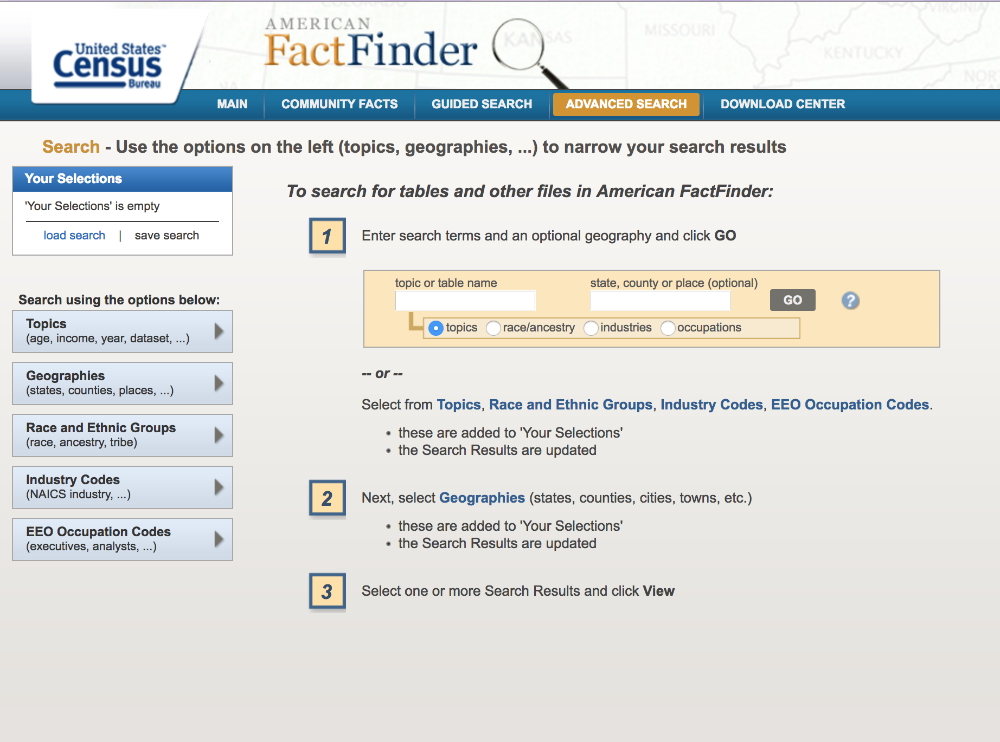
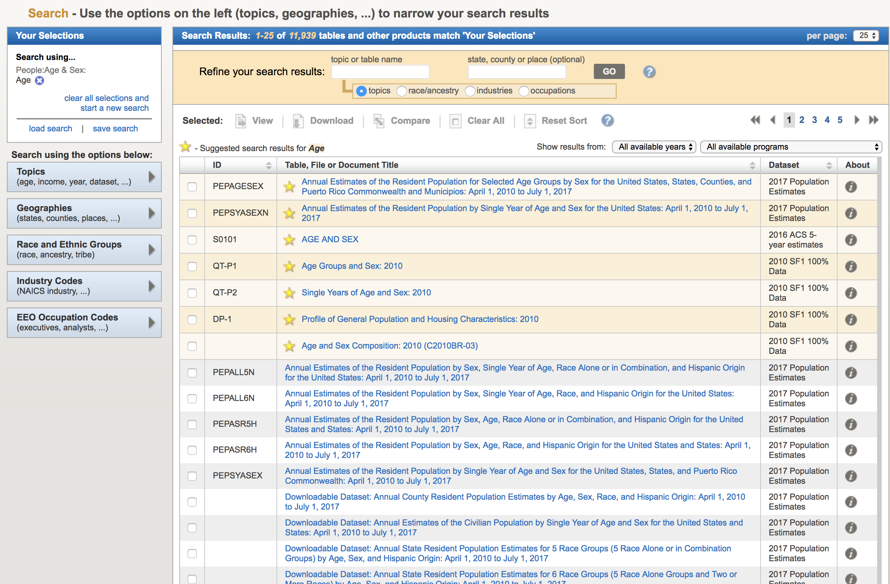

Census American Community Survey Intro (ACS5-2016)
==============================

A repo that shows how to use FactFinder to select geographies, a useful datatable, and then how to wrangle the data.

Check out the Sphinx documentation at:

https://storydrivendatasets.github.io/census-acs-intro

# Draft guide

Visit Factfinder at: http://factfinder.census.gov/

Select the **Advanced Search** option, which will take you to a search page:

If you're new to the Census and the Factfinder, you probably won't immediately know what to search for. The first field, which is labeled *topic or table name* will take a broad search term, like **"age"** or **"race"**. 

Even before you finish typing a search term, the FactFinder site might reveal an autocomplete menu:

For now, ignore the autocompletion menu and press the search page's **Go** button.

This will take you to a new page of search results:

Before you try clicking through the results, take a quick look at the **upper-left** side of the page, at the small box with the headline, **Your Selections**. Right now, mine has **"Age"**, because that's what I searched for. The FactFinder's Advanced Search basically works by letting us apply filters and conditions until we see the table we want. Sometimes, our choices will be too restricting and no results will be returned. We can remedy this by removing filter options in the **Your Selections** mini-box.

....

### Adding geographies

When we click an item on the dropdown, it reveals a submenu of options. For "United States", there is only "United States", but we still need to select it and click the **Add to Your Selections** button:

For our current project, select the following geographies:

- United States - 010
- State - 040: All states within United States and Puerto Rico
- County - 050: All Counties within United States
- Congressional District - 500: 115th Congress

As you add each geography, you should see the selection box on the left get longer with the additional options:

Closing the **Select Geographies** panel and re-visiting [Table S0101: AGE AND SEX](https://factfinder.census.gov/faces/tableservices/jsf/pages/productview.xhtml?pid=ACS_16_5YR_S0101&prodType=table) reveals a now vastly more complicated data table.

Not only are the age metrics listed for the United States as a whole, but for every state, county, and congressional district, if you choose to side-scroll through the 21,792 available geographies.

Of course, this is not an ideal way to view the data. Typically, once we've selected our geographies for FactFinder, we specify the tables we're interested in, and then download the data to our computers, rather than page through it with our web browsers.

Go back to the **Advanced Search** page. Deselect the **AGE AND SEX** table as we won't be needing it. In the top-left **Selections** box, remove any search term -- i.e. "Age" -- that is in effect. 

And then, search for the term, "**S0601**", which at the time of writing, returns 2 results: the table ["SELECTED CHARACTERISTICS OF THE TOTAL AND NATIVE POPULATIONS IN THE UNITED STATES"](https://factfinder.census.gov/faces/tableservices/jsf/pages/productview.xhtml?pid=ACS_16_5YR_S0601&prodType=table), for the 1-year and 5-year versions of the 2016 ACS dataset. Even though **Table S0601** exists in multiple years, it's restricted to 2016 because we selected the geography of the congressional districts for the 115th Congress, a geography that is only relevant to the 2016 timeframe.

Check the box for the entry corresponding to the 2016 ACS5 dataset. Hit the **Download** button and FactFinder will cause your browser to download a ZIP file of the data:

If you're having trouble getting the data from FactFinder, you can find the exact file downloaded in the `data/zips` directory of this repo.

The unzipped files are in `data/raw`.

I've posted the two CSV files on Google Drive for easier viewing:

The metadata file (one row for each of the 427 data fields)
https://docs.google.com/spreadsheets/d/1nEyWFD-h3NnAJX3-ef1Yl0zhvVDn5ntai1O0sdprZDM/edit#gid=100762371

The actual data file, which has 3,600+ rows, one for each of the geographical locations we requested.
https://docs.google.com/spreadsheets/d/1nEyWFD-h3NnAJX3-ef1Yl0zhvVDn5ntai1O0sdprZDM/edit#gid=1413001028

